# Mixins y Traits: Conceptos Fundamentales y Comparación
En la clase anterior, habíamos planteado la idea de que, con herencia simple, **una clase no puede heredar de dos clases a la vez**.
Es por esto que buscaremos una forma de solucionar este problema sin repetir código.

*"No vivas con ventanas rotas"*

## Introducción

Los **Mixins** y **Traits** son mecanismos de programación orientada a objetos diseñados para resolver problemas fundamentales de la herencia, especialmente los relacionados con la herencia múltiple y la reutilización de código. Ambos permiten componer comportamientos de manera modular, pero difieren significativamente en su filosofía y mecanismos de resolución de conflictos.

## Conflictos y El Problema de la Herencia Múltiple
Cuando se sobreescribe un método, por ejemplo si:
```
s {
    m();
}

c inherits s {
    m()
}
```
#### ¿Con qué método nos quedamos?¿El de s o el de c? 
Los lenguajes de programación suelen preferir el método de c (se utiliza la sobreescritura), pero existen otras formas de resolver estos **conflictos**. 
El problema del diamante es un ejemplo claro, no se sabe cuál de los dos métodos debe ser el que prevalece por sobre el otro.

### Definición y Problemática

La **herencia múltiple** permite que una clase herede comportamientos de más de una clase padre. Sin embargo, introduce el famoso **problema del diamante**, una ambigüedad que surge cuando una clase hereda de dos clases intermedias que comparten un ancestro común.

### El Problema del Diamante

Consideremos la siguiente jerarquía:

```
    Person
   /      \
Graduate  Doctor
   \      /
Research-Doctor
```

Cuando `Research-Doctor` hereda tanto de `Graduate` como de `Doctor`, y ambas clases extienden `Person`, surge la ambigüedad: ¿qué implementación de los métodos de `Person` debe usar `Research-Doctor`? ¿Se deben ejecutar los métodos de `Person` una vez o múltiples veces?

### Ejemplo en CLOS (Common Lisp Object System)

```lisp
(defclass Person () (name))
(defmethod display ((self Person)) 
  (display (slot-value self 'name)))

(defclass Graduate (Person) (degree))
(defmethod display ((self Graduate)) 
  (call-next-method) 
  (display (slot-value self 'degree)))

(defclass Doctor (Person) ())
(defmethod display ((self Doctor)) 
  (display "Dr. ") 
  (call-next-method))

(defclass Research-Doctor (Doctor Graduate) ())
```

En este ejemplo, en el caso de CLOS, se resuelve el problema mediante **linearización**, convirtiendo el grafo de herencia en una lista lineal: `Research-Doctor → Doctor → Graduate → Person`.

Esto significa que cuando se llama al método `display` sobre una instancia de `Research-Doctor`:

1. Primero se busca en `Research-Doctor`, pero como no redefine `display`, se pasa al siguiente.  
2. Se ejecuta el método de `Doctor`, que imprime `"Dr. "` y luego invoca `call-next-method`.  
3. Esto transfiere el control a `Graduate`, que a su vez llama a `call-next-method` y después imprime el grado académico.  
4. Finalmente, se llega a `Person`, que imprime el nombre.  

De esta forma:  
- **Cada ancestro participa solo una vez** en la ejecución.  
- **El orden está definido por la linearización**, garantizando consistencia y evitando repeticiones.  
- **Cada coleccion de definiciones de métodos puede invocar metodos después en la secuencia linearizada llamando a `call-next-method`**

Cada método se aplica sobre el resultado del anterior, lo que permite ejecutar métodos de diferentes tipos en un orden definido:

- **before:** se ejecutan **antes** del método principal.  
- **primary:** es el método **principal**, que realiza la acción central.  
- **after:** se ejecutan **después** del método principal.


### Limitaciones de la Herencia Múltiple Clásica

- **Ruptura del encapsulamiento**: Las clases pierden control sobre el orden de ejecución
- **Dependencias frágiles**: Las clases terminan dependiendo de toda la jerarquía
- **Conflictos implícitos**: Los métodos pueden ser sobrescritos silenciosamente

## Mixins: Extensiones Especializables


### Definición y Concepto

Un **mixin** es un conjunto de **extensiones especializables para clases** que actúa como una subclase abstracta parametrizable. Los mixins permiten:

- **Reutilizar y extender funcionalidades** más allá de las jerarquías rígidas
- Sobreescribir o extender métodos de otras clases
- Mantener herencia simple mientras incorporan comportamientos modulares

### Características Fundamentales

1. **Linealización automática**: Los conflictos se resuelven automáticamente mediante una estrategia de linearización que establece prioridades. Se sigue la **cadena de ancestros (linearización)**. El último mixin incluido tiene prioridad (sea una clase o mixin); `super` permite encadenar la ejecución. Esto puede causar ambigüedades silenciosas (*fragile hierarchies*).
2. **Flexibilidad**: Permiten compartir comportamientos sin modificar la jerarquía original
3. **Estado incluido**: Los mixins pueden mantener estado de manera predeterminada
4. **Resolución implícita**: Los conflictos se manejan automáticamente, lo que puede ocultar ambigüedades. 

Se debe definir si D prefiere quedarse con B o con C. Por ejemplo:

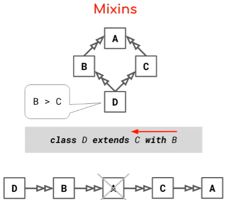

Se prioriza B. Si no lo encuentra en B, lo busca en A y sino en C. Generalmente ese paso intermedio de verificar A los lenguajes lo saltean.

### Implementación en Ruby

Ruby implementa mixins a través de **módulos** que se integran usando `include`:

#### Ejemplo Básico

```ruby
module GraduateMixin
  attr_accessor :degree
  
  def display
    super if defined?(super)
    puts degree
  end
end

class Person
  attr_accessor :name
  
  def display
    puts name
  end
end

class Graduate < Person
  include GraduateMixin
end

grad = Graduate.new
grad.name = "Alice"
grad.degree = "Ph.D."
grad.display
# Salida:
# Alice
# Ph.D.
```

**Funcionamiento**:
- El mixin `GraduateMixin` se "mezcla" con la clase `Graduate` mediante `include`
- `super` dentro del mixin llama al método de la clase padre, extendiendo su comportamiento. El **super llama al siguiente elemento en la lineanización**, puede ser una clase o un mixin. 
- La cadena de herencia lineal es: `Graduate → GraduateMixin → Person`

#### Combinación de Múltiples Mixins

```ruby
module MixinA
  def greet
    puts "Hola desde MixinA"
    super if defined?(super)
  end
end

module MixinB
  def greet
    puts "Hola desde MixinB"
    super if defined?(super)
  end
end

class Persona
  include MixinA
  include MixinB
  # // ¿Existe un conflicto ya que Persona no sabe qué metodo greet() implementar?
  # // No, el orden soluciona y da prioridad. Se toma MixinB
  
  def greet
    puts "Hola desde Persona"
  end
end

p = Persona.new
p.greet
# Salida:
# Hola desde MixinB
# Hola desde MixinA
# Hola desde Persona
```

**Explicación del orden**:
- Ruby respeta el orden de inclusión para la linearización
- Los mixins incluidos más recientemente (últimos) tienen mayor prioridad 
- La cadena final es: `Persona → MixinB → MixinA → Persona`

### Ventajas y Limitaciones de los Mixins

**Ventajas**:
- Flexibilidad en la composición de comportamientos
- Linearización asegurada que garantiza el funcionamiento de `super`
- Evita duplicación de código
- Sintaxis simple e intuitiva

**Limitaciones**:
- Resolución automática puede ocultar conflictos importantes
- Dependencia del orden de inclusión puede crear fragilidad
- Menor control granular sobre la resolución de conflictos

## Traits: Composición Simétrica y Control Explícito
"Dado que el rol principal de las clases es instanciar, deben ser completas [...] lo cual las hace inapropiadas para su rol secundario de repositorios de métodos reutilizables"

Por ende los roles que termina cumpliendo la clase son:
- Las clases sirven para instanciar objetos
- Componer Traits (Glue Code): combina para resolver conflictos
- Definir el estado, en un principio

### Definición y Filosofía

Los **traits** son unidades de reutilización de comportamiento que ofrecen **composición simétrica y control explícito** sobre los conflictos. A diferencia de los mixins, los traits exigen resolución manual de ambigüedades, proporcionando mayor granularidad y control al desarrollador.

Ducasse introduce un álgebra que permite tener un control más fino, pero también exige más trabajo.

En el ejemplo de A, B, C y D: 

Se dice que B y C no son combinables, a menos que uno los resuelva a mano. Se da un control más fino.

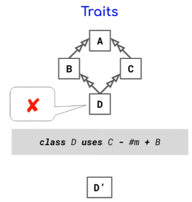

-*"Se utiliza C sin el método m() pero con el resto de B."*

### Características Fundamentales

1. **Composición conmutativa y asociativa**: El orden de composición no afecta el resultado
2. **Flattening**: El comportamiento es equivalente a tener los métodos definidos directamente en la clase. "Inyecta" código de los traits en las clases, los traits no existen en runtime. Es como la solución del copy-paste pero hecha herramienta. "Es como un script que copia y pega por mi y luego lo quita".
3. **Sin estado por defecto**: Los traits no incluyen estado automáticamente
4. **Resolución explícita**: Los conflictos deben resolverse manualmente (álgebra).

### Propiedades Únicas de los Traits

#### Flattening vs Linearization

- **Flattening:**  
  La clase resultante es **equivalente** a que todos los métodos de los traits estuvieran escritos directamente en la clase. → Esto asegura que la semántica no dependa del orden de composición.
  La semántica de la clase con traits es la misma que si los métodos estuvieran escritos directamente (**propiedad de flattening**).

  Se define qué traits se van a agregar y cómo en un momento determinado. Luego de eso, para el que usa la clase todo funciona como si el comportamiento traido de los traits fuese propio de la clase.
  Se aplanan. Ante **super se llama a la superclase**, no puedo hacer que un trait apunte a otro.

- **Diferencia con Linearization (herencia múltiple / mixins):**  
  Los métodos se resuelven en una **cadena lineal de búsqueda**.  
  Esto puede causar:  
  - Ambigüedad (*problema del diamante*).  
  - Fragilidad: un cambio en un mixin altera el comportamiento de múltiples clases.
  
  Se agregan lugares donde buscar para el method lookup. Hay un orden definido en el cual se recorren todos esos lugares por lo que no es ambiguo la implementación del método que se va a usar.

**Implicación para el programador:**  
**Con flattening se puede pensar la clase “aplanada”. Es más entendible y predecible. Con linearization se debe razonar sobre el orden de inclusión y jerarquía, lo cual complica el mantenimiento.**
El flattening es más simple y predecible que la linearización, eliminando la fragilidad asociada con el orden de herencia.

### Implementación en Scala

#### Ejemplo Básico

```scala
trait CircleTrait { 
  def radius: Double 
  def area: Double = Math.PI * radius * radius 
  def circumference: Double = 2 * Math.PI * radius 
}

trait Drawable {
  def bounds: (Double, Double, Double, Double)
  def draw(): Unit = {
    val (x1, y1, x2, y2) = bounds
    println(s"Drawing shape with bounds: ($x1, $y1) to ($x2, $y2)")
  }
}

class Circle(val center: (Double, Double), val radius: Double) 
  extends CircleTrait with Drawable {
  
  def bounds: (Double, Double, Double, Double) = { 
    (center._1 - radius, center._2 - radius, center._1 + radius, center._2 + radius) 
  } 
}

val c = new Circle((0, 0), 10)
println(c.area)
c.draw()
```

### Implementación en Scala con Resolución Explícita de Conflictos

```scala
trait Colorable {
  def color: String = "black"
  def describe(): String = s"Color: $color"
}

trait CircleInfo {
  def radius: Double
  def describe(): String = s"Radio: $radius"
}

class ColoredCircle(val radius: Double) extends CircleInfo with Colorable {
  // Existe un conflicto ya que ColoredCircle no sabe qué metodo decribe() implementar, hay que aclararlo:
  // Resolviendo conflicto explícitamente
  override def describe(): String = { 
    super[CircleInfo].describe() + ", " + super[Colorable].describe() 
  }
}

val cc = new ColoredCircle(5)
println(cc.describe())
// Salida: Radio: 5, Color: black
```

### Ventajas de los Traits

1. **Composición simétrica**: Independiente del orden de composición
2. **Resolución explícita**: Obligatoria para conflictos, evitando ambigüedades silenciosas
3. **Eliminación de fragilidad**: No hay problemas de orden o dependencias ocultas
4. **Separación de responsabilidades**: Cada trait encapsula un aspecto específico del comportamiento
5. **Previsibilidad**: El comportamiento es claro y determinístico

## Comparación Directa: Mixins vs Traits

### Tabla Comparativa

En sí, más allá de que en Scala usen la palabra clave **trait** nosotros sabemos que las decisiones tomadas para Ruby aplican mas o menos bien para Scala. Ya que la funcionalidad que cumple Scala para los traits es la "misma" que usa Ruby para los mixines. 

| Aspecto | Mixins | Traits |
|---------|--------|--------|
| **Granularidad** | A nivel de Módulos | A nivel de método, defino método por método |
| **Resolución de conflictos** | Automática (linearización) | Algebra (manual) |
| **Mec de seleccion** | Automática (linearización) | Algebra (manual) |
| **Implementación** | Linearization (el mixin existe en runtime) | Flattering (se inyecta el código, no existe el trait) |
| **Manejo de estado** | X? | Tienen estado |
| **Rol de las clases** | Instanciación de objetos y repositorio de código (métodos/lógica) | Instanciación + glue code (componer traits) |

Mixin no tiene estado, es uno de los problemas principales, ya que nada dice que en una relación 

```C -|> B -|> A``` 

A y B pueden tener un método que utiliz un atributo x que en C es privado.

### Resolución de Conflictos

#### Mixins (Automática)
```ruby
# En Ruby, el último mixin incluido tiene prioridad
class MyClass
  include ModuleA  # define method_name
  include ModuleB  # también define method_name
end

# ModuleB.method_name será usado automáticamente
```

#### Traits (Explícita)
```scala
// En Scala, los conflictos deben resolverse manualmente
class MyClass extends TraitA with TraitB {
  // Error de compilación si ambos traits definen el mismo método
  // Debe resolverse explícitamente:
  override def conflictingMethod = {
    TraitA.super.conflictingMethod + TraitB.super.conflictingMethod
  }
}
```

## Rol de las Clases en Ambos Paradigmas

### En el Contexto de Mixins

Las clases podrían tener un **rol primario** claro:
- **Instanciación de objetos**: Su función principal y tradicional
Sin embargo, no queda definido, nada impide generar clases anónimas, la clase está destinada a morir, queda a preferencia del programador.

### En el Contexto de Traits

Las clases adoptan un **rol dual**:
- **Instanciación de objetos**: Mantienen su función tradicional
- **Glue code**: Actúan como ensambladores que resuelven conflictos y definen cómo se combinan los traits
- **Mayor responsabilidad compositiva**: Deben manejar explícitamente la resolución de conflictos

## Presencia en Tecnologías Modernas

## Presencia en Tecnologías
### Ruby

- Granularidad: Modulo, elijo que construcción quiero preferenciar y luego hago una linearización
- Resolución automática de conflictos
- Estado

### Scala

- Granularidad: Modulo, elijo que construcción quiero preferenciar y luego hago una linearización
- Resolución automática de conflictos
- Estado

### Ruby (Mixins)
```ruby
module MiModulo
    ...
end
```
- **Implementación**: Módulos con `include`, `prepend`, `extend`
- **Granularidad**: Modulo, elijo que construcción quiero preferenciar y luego hago una linearización
- **Conflictos**: Resolución automática de conflictos
- **Estado**

### Scala (Traits)
```scala
trait MiTrait{
    ...
}
```
- **Implementación**: Palabra clave `trait` con composición explícita
- **Granularidad**: Modulo, elijo que construcción quiero preferenciar y luego hago una linearización
- **Conflictos**: Resolución automática de conflictos
- **Estado**

**SON MIXINES** al final. La distinción permite dónde aplicar las cosas que se saben.

## Motivo de Coexistencia

### ¿Por qué Ambos Enfoques son Necesarios?
**Nivel de control requerido**:
   - Mixins ofrecen conveniencia automática
   - Traits proporcionan control granular

## Conclusiones

Los **Mixins** y **Traits** representan dos filosofías diferentes para abordar la composición de comportamientos en programación orientada a objetos:

- **Mixins** ofrecen una solución práctica y flexible con resolución automática de conflictos, ideal para desarrollo rápido y casos donde la conveniencia es prioritaria.

- **Traits** proporcionan una aproximación más segura y controlada, exigiendo resolución explícita de conflictos y ofreciendo composición simétrica, perfecta para sistemas complejos donde la previsibilidad es crucial.

La elección entre ellos no es binaria, sino que depende del contexto, los requisitos del proyecto y las prioridades del desarrollo. Ambos mecanismos han demostrado su valor en diferentes ecosistemas y continúan evolucionando para abordar los desafíos modernos de la reutilización de código y la composición modular.

## ¿Por qué algunas tecnologías prefieren Traits?
Porque modificar el lenguaje para que pueda aceptar mixines es más complejo que aceptar traits. Ya que todos los cambios que hacen falta para implementar traits en una tecnología que usa herencia simple son plásticos, a nivel compilador. Al aplanarse la JVM trabaja sobre herencia simple.

# Continuando el ejemplo de Age of Empires
 Teníamos el inconveniente de que Guerrero no podía heredar de Atacante y de Defensor a la vez. Lo que haremos, será modificar el diagrama para que en vez de heredar el comportamiento de Atacante y Defensor, transformar a esos dos en mixines. Quedando de esta manera:
 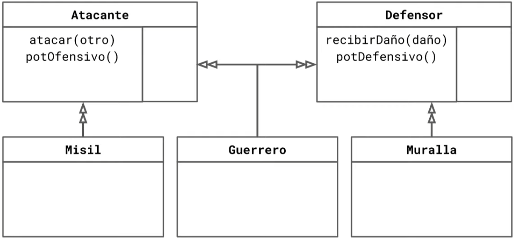
 


 En Ruby quedaría de la siguiente manera
 ```ruby
module Atacante
  attr_accessor :potOfensivo

  def atacar(otro)
    daño = self.potOfensivo() - otro.potDefensivo()
    otro.recibirDaño(daño)
  end
end

class Guerrero
  include Atacante
  include Defensor

  ...
end
 ```
 
Ahora, **no queda claro en la linearización quién predomina por sobre el otro**. El Guerrero ¿es más Atacante o más Defensor?

Ese es un primer problema, ahora predomina el Defensor, pero en un futuro, ¿puedo saber si el Defensor predominaba por algo en particular o si fue elegido así de forma arbitraria?

## Kamikaze
Es Atacante y es Defensor, pero cuando ataca después explota. ¿Cómo lo implementamos?
1. Si pensamos desde la herencia simple podríamos extender Kamikaze de Guerrero, que en un principio no parece errado, pero quizás no se parecen tanto, y es simplemente una herencia totalmente mecánica (porque tienen los mismos métodos). La pregunta pasa a ser más a nivel negocio porque contamos con mixines.
2. No necesito que Kamikaze herede de guerrero, puedo hacerlo simplemente incluyendo el kamikaze y utilizando los dos mixines. Y la lógica extra la agrego en la clase kamikaze luego de llamara a super
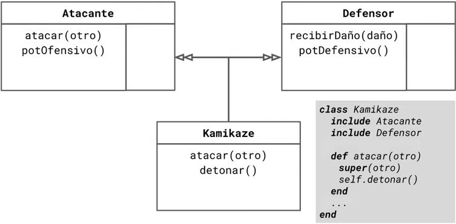

Se le pone 3 cabezas ala relación que pesa más.

La búsqueda cuando kamikaze llama a super es la siguiente:
```
Kamikaze → Defensor → Atacante → RubyObject
```
Entonces vimos como se lineariza en combinación con un mixin. No necesitamos heredar de algo solo porque nos cerraba, todavía tenemos "la lógica de la herencia simple".

## Introducción de "Conflictos"
Surge la opción de **reposar**, un comportamiento el cual debe ser diferente para los Atacantes y para los Defensores. El atacante gana +1 de potencial ofensivo y el defensor recupera 10 puntos.

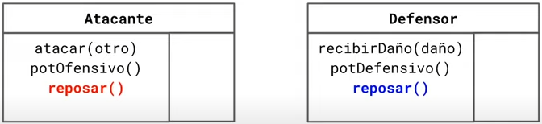

Entonces:
- Las Murallas no reposan
- Los Kamikazes solo reposan como Atacantes (hicimos bien en no heredar Kamikaze de Guerrero)
- El problema está en los Guerreros, que reposan de las dos maneras → **tenemos un conflicto**

### Muralla
No hay drama porque solo utiliza 1 mixin, es como si fuera una herencia simple, overrideo el comportamiento reposar del Defensor para que no haga nada

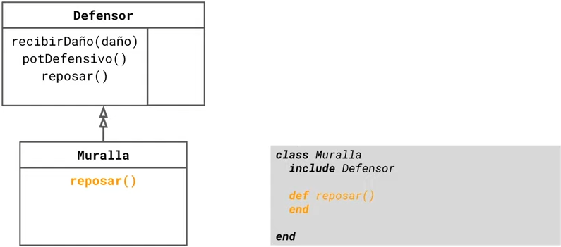

### Kamikaze
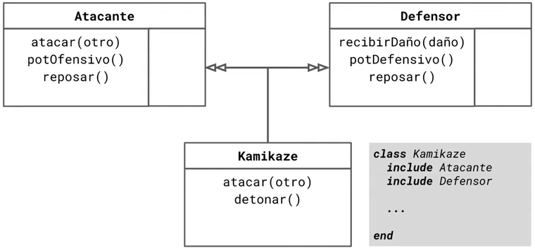

Tenemos un problema, habíamos puesto que el Kamikaze utilizaba Atacante y Defensor pero que iba a buscar primero la lógica del Defensor. Ahora tenemos que cambiar ese orden para que busque primero el método reposar en el Atacante. Quedando de esta manera:

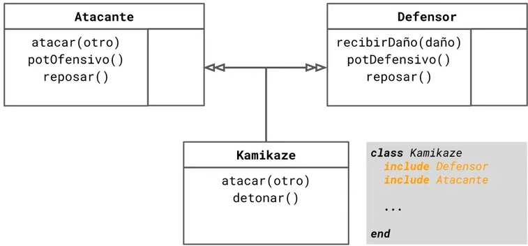

Parece un cambio simple, pero nada garantiza que este cambio, que resulta ser MUY importante está rompiendo algo o si romperá algo en el futuro. Es un cambio muy hostil, es neceario o poner un comentario o recordar de alguna forma por qué se tomó ese orden, para que si en un futuro estoy en la misma situación sepa por qué habia elegido ese orden.

Y la búsqueda de esta:
```
Kamikaze → Defensor → Atacante → RubyObject
```
### Guerrero
El Guerrero debe reposar de ambas formas. **No hay orden en el que pueda hacer esto**. No puedo overridear porque no sé, desde Guerrero, cuál es esa lógica de Atacante y Defensor. Soluciones:
1. #### Mixins Puros (pura aspera fea)
Solución más pura de mixin, exclusiva de Ruby.

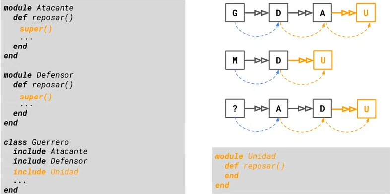

El Guerrero busca la solución en Defensor y luego en Atacante, pero ya encuentra la lógica en Defensor. Entonces:
- Agregamos `super()` tanto en el Defensor, como en el Atacante, a modo de que de cualquier forma que se ordene Atacante y Defensor, para aquellos que utilizan a ambos tengan a alguien a quien llamar que utilice reposar.
- Creamos un modulo Unidad, con un método `reposar()` que cuando reposa no hace nada, es **una construcción terminadora**. Para que, en el caso de que si un Atacante intenta llamar a super y no tiene a nadie atrás tenga Unidad.
- Le agregamos al Guerrero el mixin `Unidad` 

Solo faltaría que Atacante y Defensor incluyan Unidad, quedando de esta manera:

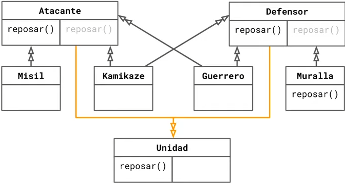

De esta forma, aunque no sepamos quién es el super, tenemos esta entidad terminadora Unidad para cortar la recursividad.

En el caso de la cadena de Guerrero quedaría de esta forma:

```
Guerrero → Defensor → Unidad → Atacante → Unidad
```

Tenemos un problema, Unidad está cortando la recursividad antes de hacer lo que hace un Atacante. Pero, para estos casos donde se repite en la cadena (Unidad en este caso) Ruby elimina esa unidad, quedando de la siguiente forma: Guerrero → Defensor → **~~Unidad~~** → Atacante → Unidad

Entonces:

```
Guerrero → Defensor → Atacante → Unidad
```

2. #### Mixins con Extras (impura linda)
Es una solución más fácil pero más impura.

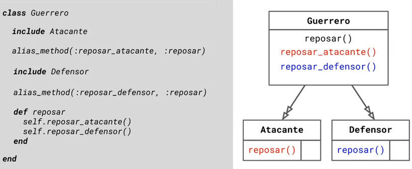
- Incluyo primero al Atacante, para que encuentre el método reposar en el Atacante.
- Utilizar `alias_method(:reposar_atacante, :reposar)` para crear una copia del método reposar que conoce (el de Atacante) y llamarla con otro nombre (reposar_atacante). Como tiene otro nombre, ya no hay más colisión.
- Se incluye al Defensor, para que tome el método reposar. El problema es que yo necesito que mi Guerrero haga estos dos métodos cuando lo manden a reposar(), es por esto que finalmente:
- Creo un alias `alias_method(:reposar_defensor, :reposar)` que, debido al orden en que fue declarado, va a copiar la lógica incluída en el Defensor.
- Ahora que tengo métodos distintos puedo overridear `reposar()`. Es una álgebra de métodos muy parecida a la de traits.

Cuando necesité granularidad, utilicé por un lado la linealización para los casos que me interesaba (como Kamikaze), y al mismo tiempo tengo una construcción más interesante de Ruby para trabajar de forma explícita cuando quiero.

El orden en el que incluí Atacante y Defensor y declaré los alias_method hace que Ruby sea altamente destructivo, si cambio el orden explota todo. 

Es una solución bastante sucia, es más, estoy utilizando un álgebra muy parecida a las de trait.

**Moraleja:** *No siempre lo más puro es la mejor solución, a veces es beneficioso utilizar construcciones no tan apegadas a "las ideas de alguien (Ducasse o Bracha)" y encontrar cosas superadoras en romper las herramientas utilizando trucos o "chanchadas utiles".
Pero la solución 1 es mucho más declarativa.
*