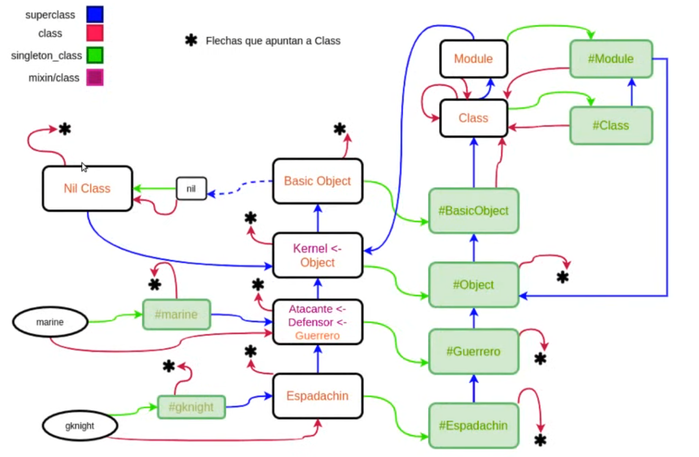

# Metaprogramación en Ruby
## ¿Qué es la metaprogramación?
Es un proceo o práctica por la cual se escriben programas que generan, manipulan o utilizan otros programas.

Algunos ejemplos pueden ser:
- Compiladores
- Formateador de código
- Herramientas de generación de documentación

### ¿Para qué se usa?
- Desarrollo de frameworks y herramientas
- Dominio de los frameworks
Algunos ejemplos son: como ORMs, Testing (JUnit), Documentadores de código o Analizadores de código

### Reflection
Es *metaprogramar* en el mismo lenguaje que los programas.
#### Tipos de Reflection
- **Introspection**: herramientas del lenguaje para poder analizarse a sí mismo. Que el programa se vea a sí mismo o que revise a otro programa.
- **Self-modification**: el programa puede cambiar el comportamiento, puede modificarse a sí mismo.
- **Intercession**: capacidad en un lenguaje de agregar una característica nueva que no esté previamente.

## Metaprogramación en Ruby
Utilizaremos la consola `pry`.
### Comandos pry
| Comando |Funcionalidad | Detalles |
|---------|--------|--------|
|`require_relative`| Importar archivo|-|
|`unObjeto.class`| Dice la clase de un objeto|-|
|`unObjeto.class.superclass `| Dice la superclase de un objeto|-|
|`unaClase.ancestors `| Muestra todos los superiores a un objeto | En forma de lista `[]`|
|`unaClase.is_a? otraClase `| Devuelve booleano | -|
|`unObjeto = Clase.new`| Instanciar un objeto |-|
|`class B < A end`| Crear clase B y heredarla de A |-|
|`unObjeto.methods`| Llama a un método |-|
|`unaClase.singleton_class`| Permite obtener la eigenclass de unaClase, *metaclass* **el objeto unaClase** | Puede servir para ver los métodos de clase, no de instancia|
|`unObjeto.methods.include? :method`| Dice si los métodos incluyen un método |-|
|`unObjeto.unMetodo`| Llama al método y muestra el valor de retorno|-|
|`unaClase.instance_methods`| Muestra los métodos que implementa la clase y su superclase |`instance_methods(false)` no incluye a la superclase|
|`unaClase.instance_method :unMetodo`| Devuelve un método de esa clase no bindeado a ningún objeto |-|
|`unMetodoNoBindeado.bind(unObjeto)`| Bindea un método no bindeado a un objeto |No se puede bindear un método a un objeto de una clase que no tenga ese método.|
|`unObjeto.send(:unMetodo)`| Llama al método y muestra el valor de retorno | Manda un mensaje explícitamente, más tipo **introspection**. Permite llamar a métodos privados. |
|`unObjeto.method(:unMetodo)`| Devuelve una instancia de method| Un método bindeado a la instancia. Lo puedo guardar |`variable = unObjeto.method(:unMetodo)`|
|`unMetodo.call`|  Llama a un método bindeado a una instancia |-|
|`unMetodo.parameters`| Dice todos los metodos de ese objeto| Los muestra como una lista de tuplas `[[:req, :un_danio]]`, el primero nos dice qué tipo de parametro es y el otro el nombre. |
|`unMetodo.arity`| Dice la cantidad de parámetros de ese método|-|
|`unObjeto.method(:unMetodo).receiver`| Devuelve a quién está bindeado un método |-|
|`unMetodoNoBindeado.owner`| Dice la clase a la que pertenece el metodo, **quien implementó el método** |-|
---
#### Variables de Instancia
|Comando|Funcionalidad|Detalles|
|---------|--------|--------|
|`unObjeto.instance_variables`| Permite ver los atributos| - |
|`unObjeto.instance_variables_get(:@unAtributo)`| Permite ver el valor de un atributo| - |
|`unObjeto.instance_variables_set(:@unAtributo, valor)`| Permite setear el valor de un atributo| - |

#### Notas
- El `:unMetodo` es un símbolo, un String.
- Hacer `unaClase.class` devuelve la clase a la que pertenece. Al sumarle a la clase perteneciente métodos, no se le agregan a la clase a la que pertence porque ensuciaría el ecosistema. 


## Self Modification en Ruby
- #### Open Classes
Es posible en cualquier momento redefinir las clases. 

Por ejemplo si ya tengo mi clase 
```ruby
class unaClase
    def blah
        2
    end
end
```
Como **Ruby es imperativo** puedo redefinir la clase
```ruby
class unaClase
    def blah
        46
    end
end
```
Y este comportamiento **es retroactivo**, el objeto no tiene el comportamiento, se lo pide a la clase.

- #### Duck typing
Por la naturaleza de Ruby de ser dinámicamente tipado, se hace referencia a un tipo de dato no por el tipo en sí sino por el comportamiento que tiene. 

- #### Monkey patching
Posibilidad de modificar un tipo, una clase o un objeto para que satisfazga las necesidades que se tienen.

## Metamodelo en Ruby
Siguiendo el ejemplo de Guerreros, el árbol quedaría de esta manera:



### Objeto auto clase
En Ruby todo es un objeto, los números, strings, arrays y también las Clases. Las clases mismas son instancias de Class. Clases tienen singleton_class Como son objetos, también pueden tener métodos definidos “solo para ellas”.
Las clases son objetos en Ruby, instancias de Class, y por eso pueden tener métodos individuales en su **singleton_class**.

El método lookup hace lo siguiente entonces:
```
unaClase -> #unaClase(Singleton) -> Superclass -> Superclass (n flechas azules)
```