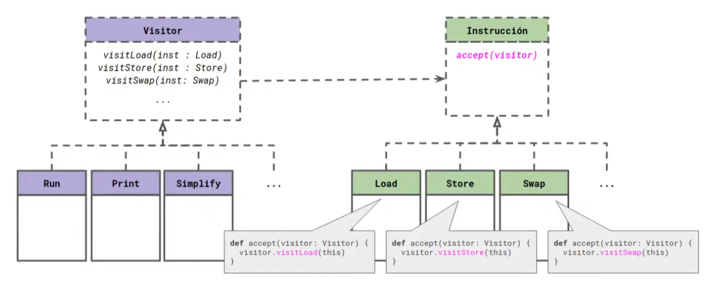

# Objeto - Funcional
Los tres conceptos que guían el pensamiento orientado a objetos son: **polimorfismo, encapsulamiento y delegación**.
Las tres aristas importantes en funcional son:
- **Orden Superior**: tener la operación como una construcción individual, trabajar con la tarea separada del dato como un dato en sí mismo.
- **Pureza**: falta de efecto, trabajar de tal manera en la que el contexto y cualquiera superior es igual al de después de una función. La **transferencia referencial** es cuando puedo sustituir una expresión por su resultado sin afectar al programa.
- **Pattern Matching**: polimorfismo paramétrico, acto de trabajar mirando el parámetro operando desde afuera, desde afuera se toman decisiones mirando lo que hay adentro.

### ¿Por qué se combina objeto con funcional?
La motivación, marcada por la industria, nace de querer aprovechar los puntos más fuertes de los dos paradigmas, teniendo un costo asociado. Se buscaba escalar los programas. Muchos problemas con BDs, y otros, estban relacionados con tener que manejar un estado, por ende, se buscaba alguna solución que no tenga estado. Objetos no tenía tan buena herramientas para manejar esto como sí lo tenía funcional.

## Detallando conceptos
### En objetos
- **Delegación**

Un objeto expone la interfaz de los método que provee, y por cada método nos asegura que en caso de enviarle un mensaje dejará el objeto en un estado consistente. Un struct no me asegura que vaya a quedar en un estado consistente porque no puedo guardar comportamiento, se modifica desde afuera, no se maneja desde dentro. Un objeto si.

Ej: Un objeto alumno si le bajo la nota mediante un método bajarNota() me asegura que quedará en un estado consistente. Si le bajo la nota a un struct nada me asegura que lo deje en un estado consistente.

- **Encapsulamiento**

Los objetos solo deben comunicarse con quienes conocen. Los objetos deben ser los únicos responsables de modificar su estado interno mediante una interfaz expuesta que activará esos mensajes y asegura dejarlos en un estado consistente.

Funcional no asegura el encapsulamiento. Patternmatching es totalmente opuesto al encapsulamiento, no se puede encapsular en funcional porque se basa en separar la logica de la implementación.

- **Polimorfismo**

Se contrapone a Pattern Matching. En caso de necesitar una **nueva** **clase** C es más **beneficioso** tener el **polimorfismo**. 

En caso de tener una **nueva operación** es más **beneficioso** el **pattern** **matching**, ya que para los objetos, debería modificar todas las interfaces y asegurarme que todos los objetos a los que les estroy agregando ese método queden en un estado consistente.

Se ve que el `switch`, presentado en el paradigma de objetos como una "mala práctica", en la realidad puede ser más conveniente que el polimorfismo en ciertos casos.

## Patrón Visitor
Se usa cuando muchas operaciones diferentes deben realizarse sobre una estructura de objetos y quieras evitar "contaminar" sus clases con estas operaciones.

El patrón con frecuencia te fuerza a proveer operaciones públicas para acceder ale stado interno de un element, lo cual compromete le encapsulamiento.

Orientado a objetos, la mejor opción para solucionar el problema planteado, utilizando objetos puros, el Visitor resulta ser la mejor alternativa.

El patrón **Visitor** es un patrón de diseño de comportamiento que te permite separar algoritmos de los objetos sobre los que operan. Se utiliza comúnmente cuando necesitas realizar muchas operaciones distintas sobre una estructura de objetos sin cambiar sus clases.

Este patrón hace uso de **Double Dispatch**, una técnica en la que la operación que se ejecuta depende del tipo de dos objetos: el objeto que acepta el visitante y el propio visitante.

**Este es el problema planteado previamente**.

### Comparación funcional
Por sobre el Patrón Visitor, utilizando Pattern Matching, se logra analizar todas las posibilidades al mismo tiempo, y además, es más simple que utilizar un patrón.

